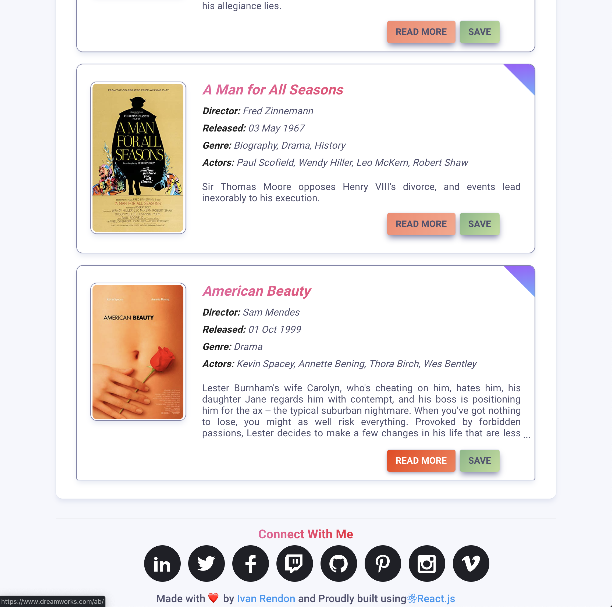

# Warner Media Movie Search :movie_camera:

A Full-Stack app build with 
React and MongoDB that that offers the user the ability to search for a movie, the application queries Warner Media's MongoDB and returns information that allows the user to view details of the movie. The application leverages React's state to save the movies that you liked and stores them in it.   

Those details include:
* Title
* Year
* Rating
* Plot
* Director
* Writer
* Cast
* Metascore

The app uses a combination of [Warner Media MongoDB](http://http://www.timewarner.com) and the [OMDB API](http://www.omdbapi.com) to grab some information that does not exist in the DB.

## Preview



## Installation
``` bash
# Clone this repository
git clone https://github.com/ivansito87/Warner_Media_Movie_Search
# Go into the repository
cd warner-media
# Install dependencies with yarn
yarn install
# Run the app
yarn start
```

## Credits
* [React](https://reactjs.org)
* [MongoDB](https://www.mongodb.com)
* [Express](https://expressjs.com)
* [Node](https://nodejs.org/en/)
* [Axios](https://github.com/mzabriskie/axios)
* [OMDB API](http://www.omdbapi.com)
* [Bootstrap](http://getbootstrap.com)
* [Font Awesome](http://fontawesome.io)

#### API

**Url**: *GET /api/movie/:TitleName*


**Example request:** 
```javascript
  getMovie: function (movie) {
      return axios.get("/api/movie/" + movie)
    }
```

**Example response:**

  ``` JSON

      [{
        "ReleaseYear" : 1966,
    "Storylines" : [ 
        {
            "Description" : "Sir Thomas Moore opposes Henry VIII's divorce, and events lead inexorably to his execution.",
            "Language" : "ENGLISH",
            "Type" : "Baseline"
        }, 
        {
            "Description" : "Henry VIII wants to divorce his wife, and seeks the approval of the aristocracy. Sir Thomas More is a man of principle and reason, and is thus placed in a difficult position: should he stand up for his principles, risking the wrath of a corrupt King fond of executing people for treason? Or should he bow to the seemingly unstoppable corruption of Henry VIII, who has no qualms about bending the law to suit his own needs?",
            "Language" : "ENGLISH",
            "Type" : "IMDB"
        }, 
        {
            "Description" : "Sir Thomas Moore opposes Henry VIII's divorce, and events lead inexorably to his execution.",
            "Language" : "ENGLISH",
            "Type" : "Turner External"
        }, 
        {
            "Description" : "A MAN FOR ALL SEASONS is one of those unique films that is, at once, prestigious and commercial. The studio took a large gamble when it agreed to film Bolt's play, even though it had been a hit with the ^Icognoscenti^R of London and New York.",
            "Language" : "ENGLISH",
            "Type" : "Turner Internal"
        }
    ],
    "TitleId" : 12708,
    "TitleName" : "A Man for All Seasons",
    "TitleNameSortable" : "Man for All Seasons, A",
    "_id" : "5376b81fbc028417ac633778"
      },
      ...
      ]

  ```

## License
This software is licensed under The MIT License (MIT). Which means that you can use, copy, modify, merge, publish, distribute, sublicense, and/or sell copies of the software. But you always need to state that xWeb is the original author of this template.

Made with ❤️ designed, developed and maintained by [Ivan Rendon](https://www.ivanrendon.dev/).